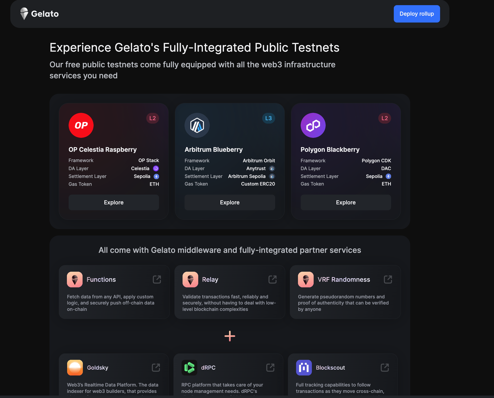
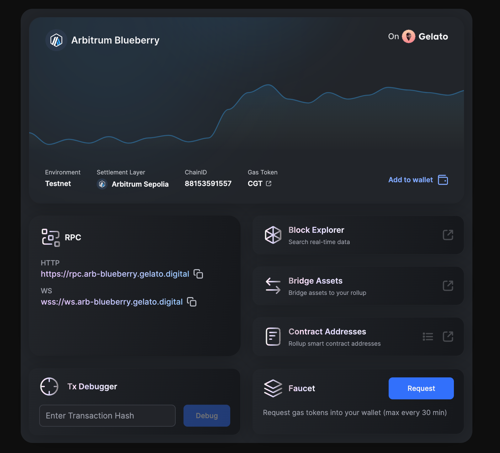
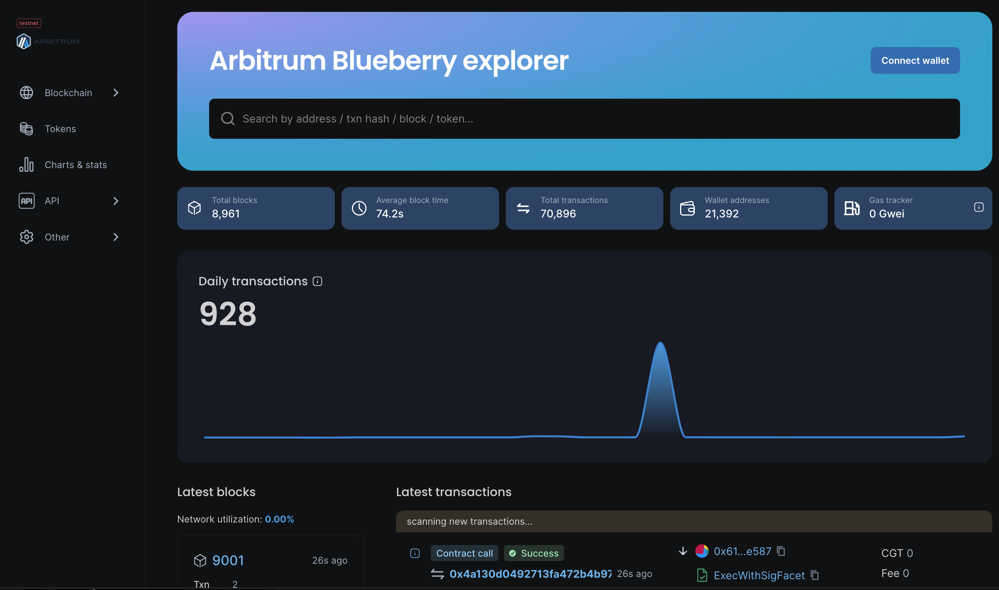

# HOW TOs 11: Passkeys on Rollups

We will learn how to use ZeroDev Passkeys on Gelato Rollups

[](https://youtu.be/GwHKuZRZMQs)


## ZeroDev Passkeys
Passkeys are cryptographic key pairs created on end-user devices. Apple and Google are two major industry players pushing for the passkeys standard, which means that passkeys are widely available on consumer devices such as:

iPhones / iPads / Macbooks
Android phones / tablets
Chrome (on Windows / Mac / Android)


[Follow the tutorial here.](https://docs.zerodev.app/sdk/getting-started/tutorial-passkeys)

## Arbitrum Blueberry


Please go ahead and visit our [Public testnets Page](https://raas.gelato.network/public-testnets)

  

We can see the current available networks, when chosing one we will go to the rollup overview with the relevant information to get started: chainId, rpc, blockexplorer, etc.. 

  

Clicking on the block explorer you will we redirected to the blockscout instance dor this rollup

  


## Demo
1) Install

```ts
npm i
```
2) Go to [ZeroDev Dashboard](https://dashboard.zerodev.app/) create an project Id and copy into the `constants.ts` file

3) Run the demo

```ts
npm run dev
```